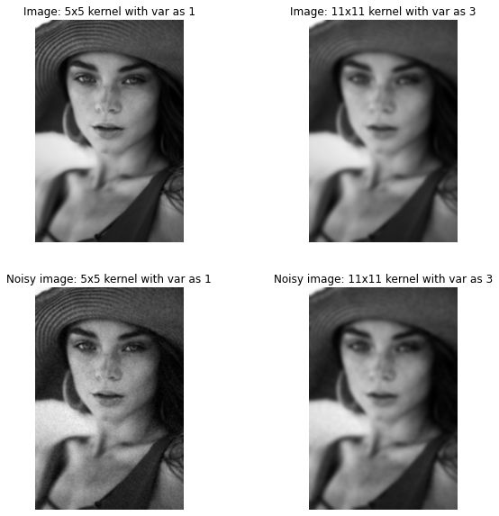

# Computer Vision

## Project 1 - This Project has 6 Seperate Parts  : 

1. Gaussian Convolution
2. Median Filtering
3. Separable Convolutions
4. Laplacian of Gaussian
5. Histogram Equalization
6. Low Pass and High Pass Filters

**Install Python packages:** install Python packages: numpy, matplotlib, opencv-python using pip, for example:

``` 
import sys
import cv2
import math
import numpy as np
import matplotlib.pyplot as plt
from scipy import ndimage, misc
from IPython.display import display, Image
from mpl_toolkits.mplot3d import Axes3D
from matplotlib import cm
```

Below is a simple example for image thresholding. 
``` 
# function for image thresholding
def imThreshold(img, threshold, maxVal):
    assert len(img.shape) == 2 # input image has to be gray
    
    height, width = img.shape
    bi_img = np.zeros((height, width), dtype=np.uint8)
    for x in range(height):
        for y in range(width):
            if img.item(x, y) > threshold:
                bi_img.itemset((x, y), maxVal)
                
    return bi_img
```

``` 
# read the image for local directory (same with this .ipynb) 
img = cv2.imread('SourceImages/fruits.jpg')

# convert a color image to gray
img_gray = cv2.cvtColor(img, cv2.COLOR_BGR2GRAY)

# image thresholding using global tresholder
img_bi = imThreshold(img_gray, 127, 255)

# Be sure to convert the color space of the image from
# BGR (Opencv) to RGB (Matplotlib) before you show a 
# color image read from OpenCV
plt.figure(figsize=(18, 6))
plt.subplot(1, 3, 1)
plt.imshow(cv2.cvtColor(img, cv2.COLOR_BGR2RGB))
plt.title('original image')
plt.axis("off")

plt.subplot(1, 3, 2)
plt.imshow(img_gray, 'gray')
plt.title('gray image')
plt.axis("off")

plt.subplot(1, 3, 3)
plt.imshow(img_bi, 'gray')
plt.title('binarized image')
plt.axis("off")

plt.show()
```

Result: 

 <br />
 <br />
 <br />

## Part 1 - Gaussian Convolution 

 * **Subcomponent 1-a**: Write a function in Python that takes two arguments, a width parameter and a variance parameter, and returns a 2D array containing a Gaussian kernel of the desired dimension and variance. The peak of the Gaussian should be in the center of the array. Make sure to normalize the kernel such that the sum of all the elements in the array is 1. Use this function and the OpenCV’s filter2D routine to convolve the image and noisy image arrays with a 5 by 5 Gaussian kernel with sigma of 1. Repeat with a 11 by 11 Gaussian kernel with a sigma of 3. There will be four output images from this problem, namely, image convolved with 3x3, 11x11, noisy image convolved with 3x3, and 11x11. Once you fill in and run the codes, the outputs will be saved under Results folder. These images will be graded based on the difference with ground truth images. You might want to try the same thing on other images but it is not required. Include your notebook and the saved state where the output is displayed in the notebook.

<style>
pre {
  overflow-y: auto;
  max-height: 300px;
}
</style>
``` 
def genGaussianKernel(width, sigma):
    
    # define your 2d kernel here 
    x = [x-int(width/2) for x in range(width)] # Create std defined 1D array with difference of 1
    g = np.exp((np.square(x) / np.square(sigma))/-2) # Gauss formula 1D
    kernel = np.outer(g, g) #multiply 2 1D vectors to make 2D kernel => Seperability
    kernel = kernel / np.sum(kernel) # normalize
    return kernel

# Load images
img       = cv2.imread('SourceImages/pic.jpg', 0)
img_noise = cv2.imread('SourceImages/pic_noisy.jpg', 0)
img3 = cv2.imread('SourceImages/travis.png', 0)
# Generate Gaussian kernels
kernel_1 = genGaussianKernel(5, 1)#Fill in your code here      # 5 by 5 kernel with sigma of 1
kernel_2 = genGaussianKernel(11, 3)#Fill in your code here      # 11 by 11 kernel with sigma of 3

# Convolve with image and noisy image

res_img_kernel1 = cv2.filter2D(src = img, ddepth = -1, kernel = kernel_1)
res_img_kernel2 = cv2.filter2D(src = img, ddepth = -1, kernel = kernel_2)
res_img_noise_kernel1 = cv2.filter2D(src = img_noise, ddepth = -1, kernel = kernel_1)
res_img_noise_kernel2 = cv2.filter2D(src = img_noise, ddepth = -1, kernel = kernel_2)

# Write out result images
cv2.imwrite("Results/P1_01.jpg", res_img_kernel1)
cv2.imwrite("Results/P1_02.jpg", res_img_kernel2)
cv2.imwrite("Results/P1_03.jpg", res_img_noise_kernel1)
cv2.imwrite("Results/P1_04.jpg", res_img_noise_kernel2)

# Plot results
plt.figure(figsize = (10, 10))
plt.subplot(2, 2, 1)
plt.imshow(res_img_kernel1, 'gray')
plt.title('Image: 5x5 kernel with var as 1')
plt.axis("off")

plt.subplot(2, 2, 2)
plt.imshow(res_img_kernel2, 'gray')
plt.title('Image: 11x11 kernel with var as 3')
plt.axis("off")

plt.subplot(2, 2, 3)
plt.imshow(res_img_noise_kernel1, 'gray')
plt.title('Noisy image: 5x5 kernel with var as 1')
plt.axis("off")

plt.subplot(2, 2, 4)
plt.imshow(res_img_noise_kernel2, 'gray')
plt.title('Noisy image: 11x11 kernel with var as 3')
plt.axis("off")

plt.show()
```
Result: 


<hr />
 <br />
 <br />
 <br />

 * **Subcomponent 1-b**:
 (a)Write a function to generate an image with salt and pepper noise. The function takes two arguments, the input image and the probability that a pixel location has salt-pepper noise. A simple implementation can be to select pixel locations with probability ‘p’ where noise occurs and then with equal probability set the pixel value at those location to be 0 or 255.(Hint: Use np.random.uniform())
(b)Write a function to implement a median filter. The function takes two arguments, an image and a window size(if window size is ‘k’, then a kxk window is used to determine the median pixel value at a location) and returns the output image. Do not use any inbuilt library (like scipy.ndimage_filter) to directly generate the result.
For this question display the outputs for “probabilty of salt and pepper noise” argument in the noisy_image_generator function equal to 0.1 and 0.2, and median filter window size in median_filter function equal to 5x5.
(c) What is the Gaussian filter size (and sigma) that achieves a similar level of noise removal.

```
# Function to generate image with salt and pepper noise
import copy
def noisy_image_generator(img_in, probability = 0.1):
  # define your function here
  # Fill in your code here
  img_out = copy.deepcopy(img_in)
  for r in range(len(img_out)):
    for c in range(len(img_out[r])):
      rand_num = np.random.uniform(0.0, 1.0)
      if(rand_num <= .1):
        #color pixel either black or white
        choose_rand_color =  np.random.uniform(0.0, 1.0)
        if(choose_rand_color <= .5):
          img_out[r][c] = 255 # white
        else:
          img_out[r][c] = 0 # black
  return img_out
  
# Function to apply median filter(window size kxk) on the input image  
def median_filter(img_in, window_size = 5):
  # define your function here
  # Fill in your code here
  # If you're at an edge, consider that edge as "-1"
  result = copy.deepcopy(img_in)
  for r in range(len(result)):
    for c in range(len(result[r])):
      curr_nums = []
      for mr in range(int(r - window_size/2), int(r + window_size/2)):
        for mc in range(int(c - window_size/2), int(c + window_size/2)):
          if((mr >= 0 and mr < len(result)) and (mc >= 0 and mc < len(result[r]))):
            curr_nums.append(img_in[mr][mc])
      curr_nums.sort()
      #print("Length of currnums should be <= 25: ", len(curr_nums))
      result[r][c] = curr_nums[int(len(curr_nums)/2)] # median
  return result
  
image_s_p1 = noisy_image_generator(img, probability = 0.1)  
result1 = median_filter(image_s_p1, window_size = 5)

image_s_p2 = noisy_image_generator(img, probability = 0.2)  
result2 = median_filter(image_s_p2, window_size = 5)

sp_gauss_kernel = genGaussianKernel(10,10)
image_s_p_gauss = cv2.filter2D(src = image_s_p1, ddepth = -1, kernel = sp_gauss_kernel)
cv2.imwrite("Results/P1_05.jpg", result1)    
cv2.imwrite("Results/P1_06.jpg", result2)    

# Plot results
plt.figure(figsize = (50, 40))
plt.subplot(1, 5, 1)
plt.imshow(img, 'gray')
plt.title('Original image')
plt.axis("off")

plt.subplot(1, 5, 2)
plt.imshow(image_s_p1, 'gray')
plt.title('Image with salt and pepper noise (noise_prob = 0.1)')
plt.axis("off")

plt.subplot(1, 5, 3)
plt.imshow(result1, 'gray')
plt.title('Image recovered after applying median filter')
plt.axis("off")

plt.subplot(1, 5, 4)
plt.imshow(image_s_p2, 'gray')
plt.title('Image with salt and pepper noise (noise_prob = 0.2)')
plt.axis("off")

plt.subplot(1, 5, 5)
plt.imshow(result2, 'gray')
plt.title('Image recovered after applying median filter')
plt.axis("off")

#What is the Gaussian filter size (and sigma) that achieves a similar level of noise removal.
#Answer: width = 5, sigma = 2 ###<------------------------ANSWER TO PART C! -------------->
plt.figure(figsize = (20, 16))
plt.subplot(1, 5, 1)
plt.imshow(image_s_p_gauss, 'gray')
#plt.title('Image with noise_prob = .1 recovered after applying gauss filter of width = 5, sigma = 2')
plt.axis("off")

plt.show()
```

